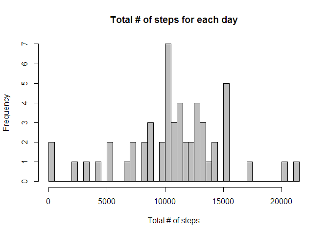
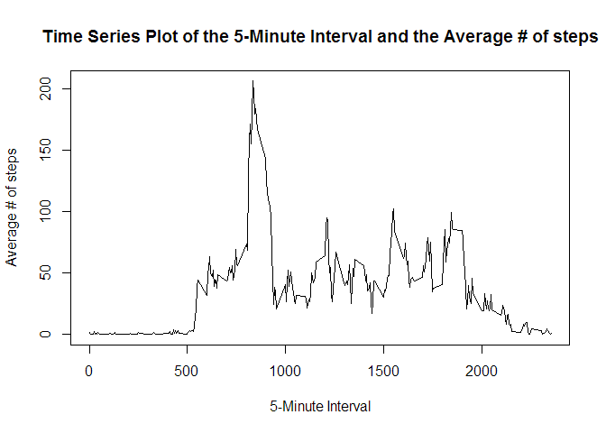
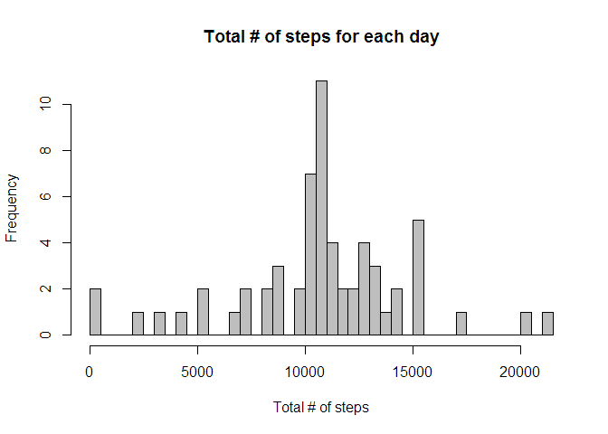
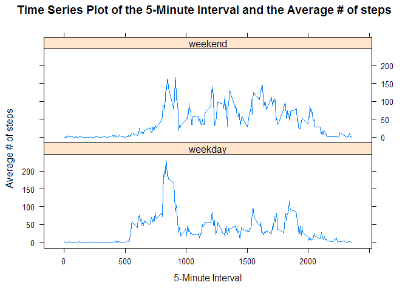

# Reproducible Research: Peer Assessment 1


## Loading and preprocessing the data

```r
library(lattice)
library(knitr)
data<-read.csv("activity.csv")
activity <- data[complete.cases(data),]
```


## What is mean total number of steps taken per day?

```r
total_steps <- aggregate(steps ~ date, activity, sum)
names(total_steps)[2] <- "total_steps"
hist(total_steps$total_steps, col="grey", 
main="Total # of steps for each day", 
xlab="Total # of steps", breaks=50)
```

 

## mean

```r
mean(total_steps$total_steps)
```

```
## [1] 10766.19
```

## median

```r
median(total_steps$total_steps)
```

```
## [1] 10765
```

## What is the average daily activity pattern?

```r
average <- aggregate(steps ~ interval, activity, mean)
names(average)[2] <- "mean_steps"

plot(
        x = average$interval,
        y = average$mean_steps,
        type = "l",
        main = "Time Series Plot of the 5-Minute Interval and the Average # of steps",
        xlab = "5-Minute Interval",
        ylab = "Average # of steps"
)
```

 

## Imputing missing values

```r
nrow(data[is.na(data$steps),])
```

```
## [1] 2304
```

```r
new_activity <- merge(data, average, by = 'interval', all.y = F)

new_activity$steps[is.na(new_activity$steps)] <- as.integer(
        round(new_activity$mean_steps[is.na(new_activity$steps)]))

new_total <- aggregate(steps ~ date, new_activity, sum)
names(new_total)[2] <- "sum_steps"

hist(
        new_total$sum_steps,
        col = "grey",
        main = "Total # of steps for each day",
        xlab = "Total # of steps",
        breaks = 50
)
```

 

## mean

```r
mean(new_total$sum_steps)
```

```
## [1] 10765.64
```
## median

```r
median(new_total$sum_steps)
```

```
## [1] 10762
```

## Are there differences in activity patterns between weekdays and weekends?

```r
weekends <- weekdays(as.Date(new_activity$date)) %in% c("Saturday", "Sunday")

new_activity$daytype <- "weekday"
new_activity$daytype[weekends == T] <- "weekend"

new_activity$daytype <- as.factor(new_activity$daytype)
new_average <- aggregate(steps ~ interval + daytype, new_activity, mean)
names(new_average)[3] <- "mean_steps"

xyplot(
        mean_steps ~ interval | daytype,
        new_average,
        type = "l",
        layout = c(1,2),
        main = "Time Series Plot of the 5-Minute Interval and the Average # of steps",
        xlab = "5-Minute Interval",
        ylab = "Average # of steps"
)
```

 
